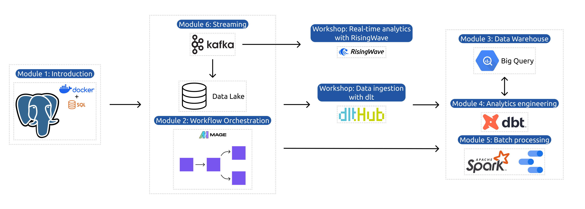

# Data Talks Data Engineering Zoomcamp

## Syllabus

### [Module 1: Containerization and Infrastructure as Code](01-docker-terraform/)

* Course overview
* Introduction to GCP
* Docker and docker-compose
* Running Postgres locally with Docker
* Setting up infrastructure on GCP with Terraform
* Preparing the environment for the course
* Homework

[More details](01-docker-terraform/)

### [Module 2: Workflow Orchestration](02-workflow-orchestration/)

* Data Lake
* Workflow orchestration
* Workflow orchestration with Mage
* Homework

[More details](02-workflow-orchestration/)

### [Workshop 1: Data Ingestion](cohorts/2024/workshops/dlt.md)

* Reading from apis
* Building scalable pipelines
* Normalising data
* Incremental loading
* Homework

[More details](cohorts/2024/workshops/dlt.md)

### [Module 3: Data Warehouse](03-data-warehouse/)

* Data Warehouse
* BigQuery
* Partitioning and clustering
* BigQuery best practices
* Internals of BigQuery
* BigQuery Machine Learning

[More details](03-data-warehouse/)

### [Module 4: Analytics engineering](04-analytics-engineering/)

* Basics of analytics engineering
* dbt (data build tool)
* BigQuery and dbt
* Postgres and dbt
* dbt models
* Testing and documenting
* Deployment to the cloud and locally
* Visualizing the data with google data studio and metabase

[More details](04-analytics-engineering/)

### [Module 5: Batch processing](05-batch/)

* Batch processing
* What is Spark
* Spark Dataframes
* Spark SQL
* Internals: GroupBy and joins

[More details](05-batch/)

### [Module 6: Streaming](06-streaming/)

* Introduction to Kafka
* Schemas (avro)
* Kafka Streams
* Kafka Connect and KSQL

[More details](06-streaming/)

### [Workshop 2: Stream Processing with SQL](cohorts/2024/workshops/rising-wave.md)

[More details](cohorts/2024/workshops/rising-wave.md)

### [Project](projects)

Putting everything we learned to practice

* Week 1 and 2: working on your project
* Week 3: reviewing your peers

[More details](projects)

## Overview

### Prerequisites

To get the most out of this course, you should feel comfortable with coding and command line
and know the basics of SQL. Prior experience with Python will be helpful, but you can pick
Python relatively fast if you have experience with other programming languages.

Prior experience with data engineering is not required.

## Instructors

- [Ankush Khanna](https://linkedin.com/in/ankushkhanna2)
- [Victoria Perez Mola](https://www.linkedin.com/in/victoriaperezmola/)
- [Alexey Grigorev](https://linkedin.com/in/agrigorev)
- [Matt Palmer](https://www.linkedin.com/in/matt-palmer/)
- [Luis Oliveira](https://www.linkedin.com/in/lgsoliveira/)
- [Michael Shoemaker](https://www.linkedin.com/in/michaelshoemaker1/)

Past instructors:

- [Sejal Vaidya](https://www.linkedin.com/in/vaidyasejal/)
- [Irem Erturk](https://www.linkedin.com/in/iremerturk/)

